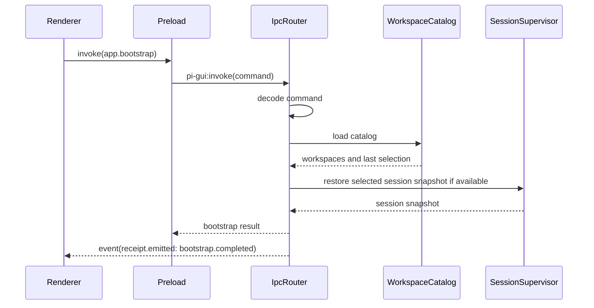
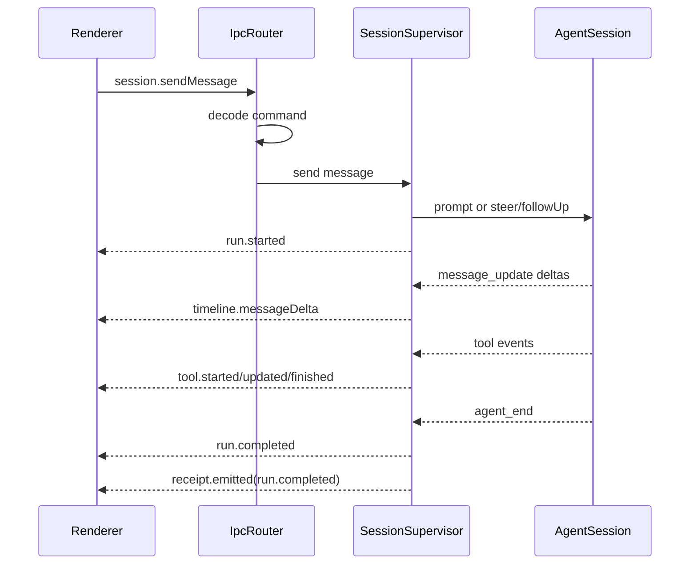
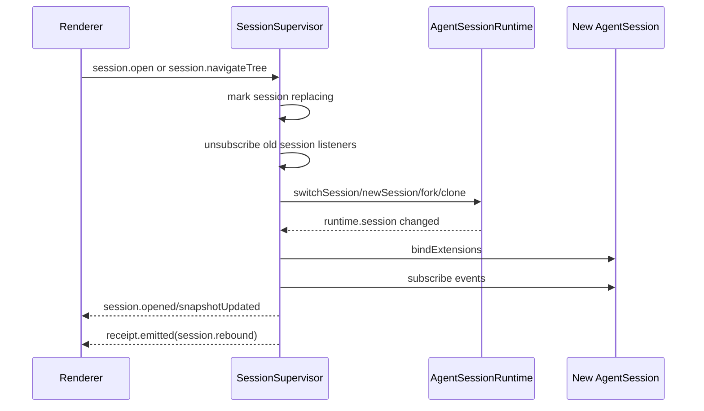
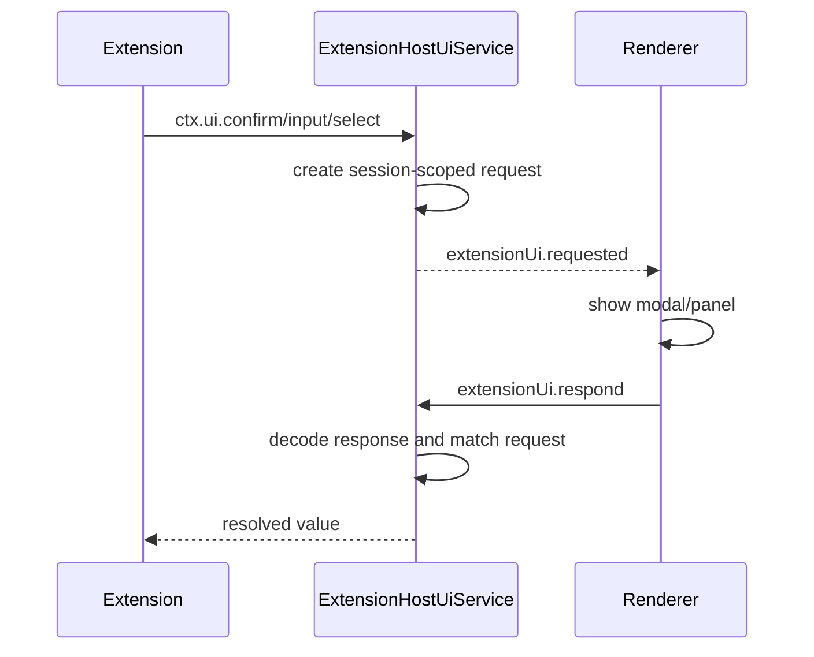

# Pi-Native GUI Technical Implementation Plan

Date: 2026-06-18
Status: Draft for review
Scope: P0 and P1 implementation plan, with P2 deferred

## Executive Summary

Pi GUI should be a Pi-native desktop host, not a separate product wrapped around Pi.

The right first architecture is an Electron package that embeds Pi through the coding-agent SDK in the Electron main process, exposes a narrow preload API, and communicates with the React renderer through Effect Schema decoded command and event contracts. This keeps the GUI aligned with Pi's extensible runtime philosophy: Pi owns sessions, transcripts, tools, settings, model selection, extensions, trust, and compaction semantics; the GUI owns desktop navigation, typed host UI, catalog read models, and rendering.

The most important decision is to avoid a permanent Node WebSocket server for P0/P1. Electron main is already a privileged Node process. Running the Pi SDK in-process avoids a subprocess/server boundary, avoids auth and socket lifecycle complexity, and preserves a future migration path by putting a protocol-shaped `SessionDriver` boundary in front of the SDK driver. If a future remote/web GUI appears, the same contracts can back a WebSocket driver later.

P0 should deliver a usable minimal host: add workspace, create/open one session, send prompts, stream timeline events, cancel, select model/thinking, inspect basic settings/trust status, handle basic extension UI, and persist a thin GUI catalog. P1 should deliver TUI parity for routine Pi work: background sessions, `/resume`, `/tree`, branch summary, `/compact`, `/trust`, focused `/settings`, slash commands, queues, skills/extensions, richer extension UI compatibility, image attachments, export/share, and stronger test receipts.

P2 is intentionally deferred: worktrees, integrated terminal, git/diff workbench, OS notifications, packaged release matrix, remote runtime adapters, and arbitrary custom extension UI hosting.

## Source Inputs

Local Pi sources used:

- `docs/plans/2026-06-17-pi-native-gui-feature-list.md`
- `docs/plans/2026-06-17-pi-native-gui-reference-research.md`
- `packages/coding-agent/docs/sdk.md`
- `packages/coding-agent/docs/sessions.md`
- `packages/coding-agent/docs/settings.md`
- `packages/coding-agent/docs/extensions.md`
- `packages/coding-agent/src/core/agent-session.ts`
- `packages/coding-agent/src/core/agent-session-runtime.ts`
- `packages/coding-agent/src/core/extensions/types.ts`
- `packages/coding-agent/src/core/session-manager.ts`
- `packages/coding-agent/src/core/slash-commands.ts`
- `packages/coding-agent/src/modes/rpc/rpc-types.ts`
- `packages/coding-agent/src/modes/interactive/components/session-selector.ts`
- `packages/coding-agent/src/modes/interactive/components/tree-selector.ts`
- `packages/coding-agent/examples/sdk/11-sessions.ts`
- `packages/coding-agent/examples/sdk/13-session-runtime.ts`

Reference repos used:

- `/tmp/pi-gui-research/t3code`
- `/tmp/pi-gui-research/synara`
- `/tmp/pi-gui-research/pi-gui`

Current documentation checked:

- Electron official docs through Context7 CLI and web docs.
- Effect official docs through Context7 CLI and web docs.
- React official docs through Context7 MCP.
- Tailwind official docs through Context7 MCP.
- electron-vite official docs through web docs.
- Playwright Electron API docs through web docs.

## Product Position

Pi GUI should be:

- A desktop host for Pi sessions.
- Minimal by default.
- Extensible by design.
- TUI-compatible where Pi semantics matter.
- SDK-driven, not file-scraping-driven.
- Schema-validated at every process boundary.
- Secure Electron by default.
- Small enough to ship in phases.

Pi GUI should not be:

- A fork of Pi's runtime.
- A transcript database.
- A replacement settings system.
- A marketing landing page.
- A generic AI workbench in P0/P1.
- A WebSocket server project before a second transport exists.
- A custom extension marketplace.

## Architectural Decisions

### Decision 1: SDK-First Driver, Protocol-Shaped Boundary

Use `@earendil-works/pi-coding-agent` in Electron main through `createAgentSessionRuntime`, `createAgentSessionServices`, `SessionManager`, `AuthStorage`, `ModelRegistry`, and the existing runtime APIs.

Expose the runtime to the rest of the GUI through a narrow `SessionDriver` service:

```ts
interface SessionDriver {
  listWorkspaces(): Effect.Effect<ReadonlyArray<WorkspaceSnapshot>, GuiError>;
  syncWorkspace(request: SyncWorkspaceRequest): Effect.Effect<WorkspaceSnapshot, GuiError>;
  createSession(request: CreateSessionRequest): Effect.Effect<SessionSnapshot, GuiError>;
  openSession(request: OpenSessionRequest): Effect.Effect<SessionSnapshot, GuiError>;
  closeSession(request: CloseSessionRequest): Effect.Effect<void, GuiError>;
  sendMessage(request: SendMessageRequest): Effect.Effect<PromptReceipt, GuiError>;
  cancelRun(request: CancelRunRequest): Effect.Effect<void, GuiError>;
  subscribe(listener: (event: SessionDriverEvent) => void): Effect.Effect<Subscription, never>;
}
```

The actual code should derive request/event types from Effect Schema, but this sketch captures the surface.

Why:

- Pi already has a TypeScript SDK designed for custom UI, desktop, and web consumers.
- Electron main is a Node process and can directly own runtime services.
- Runtime replacement for new/resume/fork/import is already modeled by `AgentSessionRuntime`.
- The protocol-shaped boundary keeps a future WebSocket, subprocess, or remote adapter possible.
- P0 avoids socket lifecycle, CORS, auth, and reconnect complexity.

When to revisit:

- A browser-only GUI needs to connect to Pi.
- Multiple renderer processes need independent runtime access.
- The desktop app needs isolated crash recovery for runtime subprocesses.
- A remote Pi daemon becomes a product goal.

### Decision 2: Effect Schema Is The Runtime Boundary

Use Effect Schema for:

- Renderer to main commands.
- Main to renderer events.
- Preload API payloads.
- GUI catalog files.
- GUI settings/read-model files.
- Extension host UI requests and responses.
- Test receipt events.
- Diagnostics envelopes.

Use `Schema.decodeUnknown` for every payload crossing Electron IPC or disk JSON. Use `Schema.TaggedRequest` for commands where success/failure schemas matter. Use tagged event unions for pushed events. Use branded IDs for workspace, session, run, request, event, extension UI request, and catalog revision IDs.

This is the fix for the main gap in the reference `pi-gui` repo: TypeScript interfaces are useful while compiling, but Electron IPC receives `unknown` data at runtime.

### Decision 3: Renderer Is A Typed Client, Not A Runtime Owner

The renderer should never import:

- `electron`
- `node:*`
- `@earendil-works/pi-coding-agent`
- `@earendil-works/pi-agent-core`
- `@earendil-works/pi-ai`

The renderer imports only:

- `contracts/`
- React UI modules.
- Local renderer state/view-model modules.

The preload exposes:

- `window.piGui.invoke(command)`
- `window.piGui.subscribe(listener)`
- Small generated convenience wrappers only if they stay schema-backed.

Preload must not expose raw `ipcRenderer`, event objects, Node modules, or Electron APIs.

### Decision 4: Thin Catalog, Pi Transcript Truth

The GUI owns a thin catalog:

- workspace path
- workspace display name
- ordering/pinned/last-opened metadata
- selected workspace/session
- session file pointer
- session preview/title/cache
- archived flag
- runtime status overlay
- renderer layout preferences

Pi owns:

- JSONL transcript files
- message entries
- tree/branch state
- active leaf
- compaction entries
- session migration
- extension-persisted session state
- model/thinking semantics
- settings and trust decisions

The GUI may cache read models, but it must be able to rebuild them from Pi's `SessionManager` and session files. The catalog must never become a second source of truth for transcript content.

### Decision 5: Extension UI Is A Host Contract

Pi's extension model is broader than custom tools. It includes commands, event hooks, user interaction, editor control, status lines, widgets, title changes, notifications, and custom TUI components.

Pi GUI should support host-compatible extension primitives in P0/P1 and emit typed compatibility issues for unsupported TUI-only APIs. Unsupported extension UI must be visible and actionable, not silently dropped.

Compatibility tiers:

- `native`: `confirm`, `input`, `select`, `notify`, `setStatus`, `setTitle`, `setEditorText`, `getEditorText`, `editor`.
- `rendered`: simple `setWidget` content rendered in a session-scoped desktop panel.
- `reported`: custom TUI components, raw terminal input, editor component replacement.
- `deferred`: arbitrary extension-provided React/UI code.

### Decision 6: P0 Starts Single-Focused, But Event Model Must Be Multi-Session Ready

P0 can expose one active session at a time in the UI, but the main process event model should already be per-session:

- all events carry `workspaceId` and `sessionId`
- stream ordering is serialized per session
- pending host UI requests are keyed by session
- runtime replacement rebinds subscriptions before emitting session-ready events
- cancellation and close clean up one session record only

This avoids a P1 rewrite when background sessions arrive.

## Package Shape

Start with one package:

```text
packages/gui/
  package.json
  CHANGELOG.md
  electron.vite.config.ts
  index.html
  tsconfig.json
  tsconfig.build.json
  src/
    contracts/
      ids.ts
      commands.ts
      events.ts
      snapshots.ts
      extension-ui.ts
      catalog.ts
      settings.ts
      errors.ts
      ipc.ts
      index.ts
    main/
      main.ts
      app-layer.ts
      services/
        AppLifecycleService.ts
        WindowService.ts
        IpcRouter.ts
        RendererEventBus.ts
        SessionDriverService.ts
        PiSdkSessionDriver.ts
        SessionSupervisor.ts
        RuntimeSupervisor.ts
        WorkspaceCatalogService.ts
        ExtensionHostUiService.ts
        SettingsBridgeService.ts
        DiagnosticsService.ts
        ReceiptService.ts
        FileDialogService.ts
      layers/
        ElectronAppLayer.ts
        ElectronWindowLayer.ts
        ElectronIpcLayer.ts
        PiSdkLayer.ts
        JsonCatalogLayer.ts
        DesktopServicesLayer.ts
    preload/
      index.ts
      window.d.ts
    renderer/
      main.tsx
      app/
        App.tsx
        AppStore.ts
        app-reducer.ts
        selectors.ts
      components/
        shell/
        sidebar/
        timeline/
        composer/
        extension-ui/
        settings/
        tree/
        resume/
      styles/
        app.css
      lib/
        pi-gui-client.ts
        external-store.ts
    test/
      contracts/
      main/
      driver/
      electron/
      fixtures/
```

Do not extract `packages/gui-contracts` or `packages/gui-session-driver` until there is a second consumer. Keep the first version in one package to reduce monorepo surface area.

## Dependency Direction

Expected direct dependencies for implementation, with exact versions pinned when added:

- `electron`
- `electron-vite`
- `vite`
- `@vitejs/plugin-react`
- `react`
- `react-dom`
- `effect`
- `@tailwindcss/vite`
- `tailwindcss`
- `lucide-react`, only if the renderer needs icon buttons and no existing local icon package is preferred

Expected dev/test dependencies, exact versions pinned when added:

- `@playwright/test`, if Electron E2E is added in-package
- Electron test helpers only if Playwright's Electron APIs are insufficient
- Existing repo TypeScript/Biome tooling should be reused

Dependency rules:

- Direct external dependencies must be pinned exactly.
- Lockfile changes are reviewed code.
- Install with `npm install --ignore-scripts`.
- Do not add lifecycle script allowlists silently.
- Do not introduce a separate package manager.

Tailwind should use the current Vite plugin style from Tailwind v4 docs (`@tailwindcss/vite` plus CSS `@import "tailwindcss"`). Keep styling sparse and token-oriented so the UI stays minimal.

## Main Process Architecture

The main process is the only side that may access:

- Pi runtime SDK.
- filesystem.
- shell/file opener APIs.
- Electron `BrowserWindow`.
- Electron `ipcMain`.
- system dialogs.
- credentials through Pi `AuthStorage`.

Main process modules:

### `main.ts`

Only bootstraps Electron:

- configure app lifecycle
- create Effect runtime/layers
- create main window
- register IPC router
- handle quit/dispose

It should stay small. If it grows beyond window creation and service bootstrapping, move logic into services.

### `WindowService`

Responsibilities:

- create the main `BrowserWindow`
- load renderer URL or built asset
- set secure `webPreferences`
- install navigation/window-open guards
- apply app menu
- route renderer events through `RendererEventBus`

Secure defaults:

```ts
webPreferences: {
  preload,
  nodeIntegration: false,
  contextIsolation: true,
  sandbox: true,
  webSecurity: true,
}
```

Guards:

- block or strictly allowlist navigation outside the app origin
- block unexpected `window.open`
- never call `shell.openExternal` on untrusted URLs
- set a restrictive Content Security Policy for production builds
- validate IPC sender for every privileged command

### `IpcRouter`

Responsibilities:

- register a small number of Electron channels
- decode every incoming command with Effect Schema
- route decoded commands to services
- encode/decode response payloads where useful
- map typed errors to renderer-safe error envelopes
- emit receipt events for E2E synchronization

Recommended channels:

- `pi-gui:invoke`
- `pi-gui:subscribe-ready` or event stream setup
- `pi-gui:renderer-ready`

Avoid one Electron channel per command. A single schema-decoded command envelope is easier to audit.

### `RendererEventBus`

Responsibilities:

- publish decoded/encoded `GuiEvent` values to the renderer
- maintain event sequence numbers
- attach `workspaceId`, `sessionId`, `runId`, and `eventId`
- avoid cross-session event bleed
- emit receipt events for deterministic tests

Event delivery should be ordered per session. Different sessions can run concurrently, but each session lane must remain ordered.

### `WorkspaceCatalogService`

Responsibilities:

- persist GUI-owned workspace metadata
- sync sessions from Pi `SessionManager`
- rebuild read models from session files
- track selected workspace/session
- store archive flags and pins
- decode catalog JSON through Effect Schema

Catalog file candidates:

```text
~/Library/Application Support/Pi GUI/catalog.json
~/.pi/gui/catalog.json
```

Prefer app support storage for Electron-native state, but keep the path explicit and documented. Do not store Pi transcripts here.

### `RuntimeSupervisor`

Workspace-scoped service for:

- settings manager
- auth storage
- model registry
- resource loader
- session manager
- project trust context
- default model/thinking resolution
- extension/skill/prompt/theme reload

It should isolate the "what does this workspace know about Pi resources?" concern from the per-session supervisor.

### `SessionSupervisor`

Per-session runtime registry:

```ts
interface ManagedSessionRecord {
  workspaceId: WorkspaceId;
  sessionId: SessionId;
  sessionFile?: string;
  runtime: AgentSessionRuntime;
  status: SessionStatus;
  runningRunId?: RunId;
  listeners: ReadonlyArray<Subscription>;
  pendingHostUiRequests: Map<ExtensionUiRequestId, HostUiRequest>;
  eventQueue: PerSessionEventQueue;
  catalogSnapshot: SessionSnapshot;
}
```

Responsibilities:

- create/open/close Pi sessions
- bind extensions for the active session
- subscribe to `AgentSession` events
- rebind subscriptions after runtime replacement
- translate Pi runtime events into GUI events
- manage pending extension UI requests
- handle prompt/steer/follow-up/abort
- handle model/thinking changes
- handle tree navigation, compaction, fork, clone, resume
- dispose resources safely

Key invariant:

Runtime replacement (`newSession`, `switchSession`, `fork`, `clone`, `import`) invalidates the old `runtime.session`. The supervisor must unsubscribe and rebind before the renderer treats the new session as ready.

### `PiSdkSessionDriver`

Adapter around Pi SDK APIs. It should be deliberately boring:

- no React concepts
- no Electron concepts except diagnostics if unavoidable
- no renderer state
- no direct IPC

This is the seam that allows a future WebSocket/subprocess driver.

### `ExtensionHostUiService`

Responsibilities:

- receive Pi extension UI calls through `ctx.ui`
- create typed host UI requests
- publish request events to renderer
- await renderer response or timeout/cancel
- bind requests to session and extension identity
- cancel pending requests on close/session replacement
- emit compatibility issues for unsupported APIs

P0 supported:

- `confirm`
- `input`
- `select`
- `notify`
- `setStatus`
- `setTitle`
- `setEditorText`
- `getEditorText`
- `editor`

P1 supported:

- simple `setWidget`
- session-scoped notification center
- editor modal polish
- compatibility issue panel

### `SettingsBridgeService`

Responsibilities:

- expose settings summary
- expose settings source paths
- open settings files safely
- edit a small focused set of common settings in P1
- delegate Pi-owned writes to Pi settings managers where possible
- decode GUI write payloads with Effect Schema

It must not create a separate Pi settings format.

### `DiagnosticsService`

Responsibilities:

- typed log events
- runtime errors
- extension compatibility issues
- catalog parse failures
- IPC decode failures
- test receipts

Diagnostics are a P0 engineering feature, even if the user-facing diagnostics UI is P2.

## Preload Architecture

Preload exposes one safe API:

```ts
window.piGui = {
  invoke(command: GuiCommand): Promise<GuiCommandResult>;
  subscribe(listener: (event: GuiEvent) => void): () => void;
};
```

Rules:

- no raw `ipcRenderer`
- no Electron event object exposure
- no Node APIs
- no Pi SDK imports
- no dynamic imports
- all command payloads treated as unknown until decoded in main
- renderer receives only schema-shaped events

Preload may validate outbound renderer commands before sending them, but main remains the authority and decodes again.

## Renderer Architecture

Renderer is a React app with a small external event store.

Use React's `useSyncExternalStore` for subscribing to the GUI event store. Use `useReducer` for deterministic state transitions. Use `useTransition` or `useDeferredValue` for expensive timeline filtering/search so composer typing remains responsive.

Renderer state layers:

1. `TransportClient`
   - wrapper over `window.piGui`
   - no business state

2. `AppEventStore`
   - receives `GuiEvent`
   - keeps immutable snapshots
   - exposes `subscribe` and `getSnapshot`

3. `AppReducer`
   - applies event-sourced state updates
   - normalizes workspace/session/timeline maps
   - keeps renderer-only UI state separate

4. Components
   - subscribe to selectors
   - send commands through action hooks
   - never call Pi runtime directly

Renderer should keep these state categories separate:

- committed main-process state from events
- optimistic local input state
- renderer-only layout state
- transient modal/dialog state

Avoid using `useEffect` as the main data-flow mechanism. Effects are for external synchronization, focus management, keyboard listeners, and cleanup.

## Contract Model

Use a single command envelope:

```ts
const GuiCommand = Schema.Union(
  BootstrapRequest,
  WorkspaceAddRequest,
  WorkspaceSyncRequest,
  SessionCreateRequest,
  SessionOpenRequest,
  SessionSendMessageRequest,
  ExtensionUiRespondRequest,
);
```

Command families:

### App Commands

- `app.bootstrap`
- `app.rendererReady`
- `app.getDiagnostics`
- `app.openPath`
- `app.revealPath`

### Workspace Commands

- `workspace.add`
- `workspace.remove`
- `workspace.select`
- `workspace.sync`
- `workspace.rename`
- `workspace.pin`
- `workspace.unpin`

### Session Commands

- `session.create`
- `session.open`
- `session.close`
- `session.rename`
- `session.archive`
- `session.unarchive`
- `session.sendMessage`
- `session.cancelRun`
- `session.setModel`
- `session.setThinkingLevel`
- `session.getTranscript`
- `session.getTree`
- `session.navigateTree`
- `session.fork`
- `session.clone`
- `session.compact`
- `session.export`
- `session.share`
- `session.reload`

### Queue Commands

- `queue.setSteeringMode`
- `queue.setFollowUpMode`
- `queue.removeSteering`
- `queue.removeFollowUp`
- `queue.replaceSteering`
- `queue.replaceFollowUp`

Only implement queue mutations that Pi supports cleanly. If Pi only exposes a subset, do not invent unsupported behavior in GUI state.

### Settings Commands

- `settings.getSummary`
- `settings.openGlobalFile`
- `settings.openProjectFile`
- `settings.updateCommon`
- `settings.reload`

### Trust Commands

- `trust.getStatus`
- `trust.prompt`
- `trust.saveDecision`

### Extension Commands

- `extensionUi.respond`
- `extensionUi.cancel`
- `extensions.list`
- `extensions.reload`
- `extensions.openSource`

### Event Families

- `app.ready`
- `app.error`
- `receipt.emitted`
- `workspace.catalogUpdated`
- `workspace.synced`
- `session.catalogUpdated`
- `session.opened`
- `session.closed`
- `session.statusChanged`
- `session.snapshotUpdated`
- `timeline.messageStarted`
- `timeline.messageDelta`
- `timeline.messageCompleted`
- `tool.started`
- `tool.updated`
- `tool.finished`
- `queue.updated`
- `run.started`
- `run.completed`
- `run.failed`
- `run.cancelled`
- `model.changed`
- `thinking.changed`
- `tree.updated`
- `compaction.started`
- `compaction.completed`
- `compaction.failed`
- `trust.statusChanged`
- `settings.summaryUpdated`
- `extensionUi.requested`
- `extensionUi.updated`
- `extensionUi.resolved`
- `extensionUi.compatibilityIssue`

### Error Taxonomy

Use tagged errors:

- `InvalidRendererCommand`
- `UnauthorizedIpcSender`
- `WorkspaceNotFound`
- `WorkspaceNotTrusted`
- `SessionNotFound`
- `SessionAlreadyOpen`
- `SessionRuntimeUnavailable`
- `PromptRejected`
- `RunAlreadyActive`
- `RunNotActive`
- `ModelUnavailable`
- `AuthRequired`
- `SettingsParseFailed`
- `CatalogParseFailed`
- `ExtensionUiRequestNotFound`
- `ExtensionUiTimedOut`
- `UnsupportedExtensionUi`
- `PiRuntimeError`
- `UnknownGuiError`

Renderer should receive structured errors with:

- `_tag`
- message
- optional cause summary
- optional remediation
- optional workspace/session/request IDs

Do not leak stack traces or secrets into renderer events by default.

## Core Data Flow

### Bootstrap



### Prompt Run



### Runtime Replacement



### Extension UI



## P0 Plan: Usable Minimal Pi Host

P0 goal: a contributor can open the desktop app, add a workspace, create or open a Pi session, send prompts, see streaming output and tool activity, change model/thinking, inspect Pi settings/trust status, handle basic extension UI, quit, reopen, and continue from the same session.

P0 must prove the real architecture, not a mocked UI.

### P0.0 Package Skeleton And Tooling

Deliverables:

- `packages/gui/package.json`
- `packages/gui/CHANGELOG.md`
- `packages/gui/electron.vite.config.ts`
- `packages/gui/tsconfig.json`
- Electron main/preload/renderer entrypoints
- root workspace inclusion if needed
- build/check scripts wired into existing repo style
- minimal app window loading renderer in dev/prod

Technical notes:

- Use `electron-vite` for main/preload/renderer bundling.
- Keep main/preload TypeScript in erasable syntax.
- Use top-level imports only.
- No inline dynamic imports.
- Reuse root Biome and TypeScript conventions.
- Do not add packaging/release automation in P0.0.

Acceptance:

- App launches a blank/minimal shell in dev.
- Renderer cannot access Node globals.
- Preload exists and exposes a placeholder typed API.
- `npm run check` passes after code changes.

### P0.1 Contracts And IPC Router

Deliverables:

- Effect Schema contract module.
- Branded IDs.
- Command schemas.
- Event schemas.
- Error schemas.
- IPC router with runtime decoding.
- Preload `invoke` and `subscribe`.
- Contract tests for valid/invalid commands.
- IPC tests for malformed payload rejection.

Initial commands:

- `app.bootstrap`
- `workspace.add`
- `workspace.select`
- `workspace.sync`
- `session.create`
- `session.open`
- `session.close`
- `session.sendMessage`
- `session.cancelRun`
- `session.setModel`
- `session.setThinkingLevel`
- `session.getTranscript`
- `extensionUi.respond`

Initial events:

- `app.ready`
- `app.error`
- `receipt.emitted`
- `workspace.catalogUpdated`
- `session.catalogUpdated`
- `session.opened`
- `session.closed`
- `session.statusChanged`
- `timeline.messageDelta`
- `tool.started`
- `tool.updated`
- `tool.finished`
- `queue.updated`
- `run.started`
- `run.completed`
- `run.failed`
- `extensionUi.requested`
- `extensionUi.resolved`
- `extensionUi.compatibilityIssue`

Acceptance:

- Unknown IPC payloads fail closed with `InvalidRendererCommand`.
- Renderer never receives raw thrown errors.
- Every event has a monotonic event sequence.
- Receipt events exist for E2E waits.

### P0.2 Secure Electron Shell

Deliverables:

- `WindowService`.
- secure `BrowserWindow` configuration.
- preload path resolution for dev/prod.
- navigation guard.
- window-open guard.
- production CSP.
- sender validation utility for IPC.
- app lifecycle disposal.

Acceptance:

- `nodeIntegration: false`.
- `contextIsolation: true`.
- `sandbox: true`.
- `webSecurity` not disabled.
- renderer cannot import Node or Electron.
- app blocks unexpected external navigation.
- privileged IPC validates sender.

### P0.3 Workspace Catalog

Deliverables:

- `WorkspaceCatalogService`.
- `CatalogSchema`.
- add/select/remove workspace.
- workspace display name.
- last opened timestamp.
- selected workspace persistence.
- workspace sync receipt.
- catalog parse recovery strategy.

Behavior:

- User adds a workspace by choosing a folder.
- Catalog stores the folder and metadata only.
- Sync asks Pi `SessionManager.list(cwd)` for sessions.
- Catalog update event refreshes sidebar.

Parse recovery:

- If catalog JSON is invalid, preserve the bad file as a backup and start with an empty catalog only after emitting a typed diagnostic.
- Never delete user data silently.

Acceptance:

- Add workspace persists across restart.
- Removing workspace removes GUI catalog entry only.
- Session files are not copied or modified by catalog operations.

### P0.4 Session Catalog And Read Model

Deliverables:

- session list for selected workspace.
- session preview/title.
- modified time.
- named session display.
- session file path.
- selected session persistence.
- archive flag in GUI catalog.

Behavior:

- Sync current workspace through `SessionManager.list`.
- Preserve GUI archive/pin state for session paths that still exist.
- Drop runtime-only status on restart.
- Do not duplicate transcript entries.

Acceptance:

- Existing Pi sessions appear in the GUI.
- Creating a new session updates the list.
- Opening an existing session displays the transcript.
- Restart/reopen restores selected workspace/session when possible.

### P0.5 Pi SDK Runtime And Session Supervisor

Deliverables:

- `RuntimeSupervisor`.
- `SessionSupervisor`.
- `PiSdkSessionDriver`.
- real `createAgentSessionRuntime` integration.
- extension binding for sessions.
- event translation from `AgentSessionEvent` to GUI events.
- prompt send/cancel.
- model/thinking set.
- session close/dispose.

Session states:

- `idle`
- `opening`
- `ready`
- `running`
- `cancelling`
- `compacting`
- `replacing`
- `closed`
- `failed`

Prompt behavior:

- If idle, use `session.prompt`.
- If running, expose Pi's steering/follow-up behavior according to current settings.
- If command cannot be accepted, return `PromptRejected`.

Acceptance:

- Real Pi prompt can stream into the GUI.
- Cancellation maps to Pi abort behavior.
- Tool events render as tool rows.
- Session dispose releases subscriptions.
- Runtime replacement does not leave stale listeners.

### P0.6 Timeline Rendering

Deliverables:

- transcript snapshot rendering.
- streaming assistant text.
- thinking section when available.
- tool execution rows.
- error rows.
- compaction/status rows where already emitted.
- stable scroll behavior.
- active run indicator.

Design:

- Main timeline is dense and readable.
- Tool rows are visually subordinate to messages.
- No decorative cards around page sections.
- Keep message containers simple.
- Support keyboard selection later without repainting the whole app model.

Acceptance:

- Existing messages load.
- Streaming deltas append smoothly.
- Tool start/update/end is visible.
- Renderer does not parse JSONL files.

### P0.7 Composer

Deliverables:

- multiline input.
- send button and keyboard send.
- cancel button during run.
- disabled states.
- basic slash command passthrough.
- editor text updates from extensions.
- local draft per session.

Behavior:

- Composer draft is renderer-local until sent.
- `setEditorText` from extension updates the active session draft.
- `getEditorText` returns active draft for that session.
- Send command includes message text and future attachment field, even if images are P1.

Acceptance:

- User can send a prompt.
- User can cancel a running prompt.
- Extension can set/get editor text for supported flows.
- Drafts do not bleed across sessions.

### P0.8 Model And Thinking Controls

Deliverables:

- current provider/model display.
- current thinking level display.
- model selector from available models.
- thinking selector.
- missing auth/model error display.

Implementation:

- Use Pi `ModelRegistry` and runtime model APIs.
- Read defaults from Pi settings/runtime.
- Persist through Pi mechanisms where Pi currently persists.
- Avoid GUI-only model state.

Acceptance:

- Controls reflect active session.
- Changing model affects the active Pi session.
- Missing auth produces a typed remediation error.

### P0.9 Basic Settings And Trust Status

Deliverables:

- settings summary panel.
- global settings path.
- project settings path when available.
- default provider/model/thinking summary.
- enabled skill commands summary.
- project trust status.
- safe "open settings file" and "reveal file" commands.

Acceptance:

- User can see where settings come from.
- GUI does not invent alternate settings storage.
- File open/reveal goes through main process with path validation.

### P0.10 Basic Extension UI Bridge

Deliverables:

- modal confirm.
- modal input.
- select dialog/list.
- notification row/toast.
- status text area.
- title update.
- editor modal.
- set/get editor text.
- unsupported UI compatibility issue event.

Implementation details:

- All requests include session ID, extension identity where available, request ID, title/message, timeout.
- Renderer response must match request ID and session ID.
- Closing/replacing session cancels pending requests.
- Unsupported `ctx.ui.custom` or raw terminal input emits `UnsupportedExtensionUi`.

Acceptance:

- Permission gate extension can ask for confirm.
- Extension input/select flows complete.
- Request from Session A cannot be answered by Session B.
- Unsupported UI is visible in diagnostics.

### P0.11 Minimal Visual Design

First screen:

```text
+---------------------------------------------------------------+
| sidebar         | timeline                                     |
| workspaces      |                                              |
| sessions        | message / tool stream                         |
|                 |                                              |
|                 |----------------------------------------------|
|                 | composer / model / thinking / status          |
+---------------------------------------------------------------+
```

Principles:

- No landing page.
- No hero.
- No decorative dashboard.
- No nested cards.
- Three regions only: sidebar, timeline, composer/status.
- Dense session list.
- Quiet typography.
- Restrained color.
- Keyboard-friendly focus.
- Icon buttons for clear commands where useful.
- Text never overlaps in narrow windows.

Acceptance:

- Core workflow is visible immediately.
- User can add/open workspace without reading feature text.
- App feels like a focused Pi host, not a generic chat app.

### P0.12 P0 Tests

Tests:

- contract decode tests.
- catalog schema tests.
- IPC invalid payload tests.
- SessionSupervisor driver tests with fixture/in-memory session where possible.
- Electron E2E launch test.
- Electron E2E add workspace/create session/send prompt with faux provider if available.
- restart/reopen test.
- extension UI confirm test.

Receipts:

- `bootstrap.completed`
- `workspace.synced`
- `session.opened`
- `prompt.accepted`
- `run.started`
- `run.completed`
- `session.rebound`
- `extensionUi.requested`
- `extensionUi.resolved`

Acceptance:

- E2E waits on receipts, not sleeps.
- Tests prove the real Electron surface.
- Docs-only changes do not require `npm run check`; code changes do.

## P1 Plan: TUI Parity Host

P1 goal: the GUI can replace the TUI for routine Pi workflows while preserving Pi semantics and minimal design.

### P1.1 Background Sessions

Deliverables:

- multiple open session records.
- per-session runtime status.
- background event streaming.
- per-session unread/activity markers.
- per-session queued message state.
- selected session independent from running sessions.
- close/abort controls per session.

Acceptance:

- Session A can run while Session B is focused.
- Events from Session A never update Session B timeline.
- Background completion updates sidebar without stealing focus.

Guardrail:

- Do not promise unlimited concurrency. Start with a small configurable limit or practical default.

### P1.2 Queue And Delivery UI

Deliverables:

- show steering queue.
- show follow-up queue.
- make steer vs follow-up explicit during active run.
- reflect Pi steering/follow-up mode settings.
- remove/replace queued messages only where Pi exposes safe APIs.

Acceptance:

- User understands what will run next.
- GUI does not create queue behavior Pi cannot execute.

### P1.3 Slash Commands And Command Palette

Deliverables:

- command palette from composer.
- built-in slash commands.
- extension commands.
- skill commands when enabled.
- command descriptions and source.
- insert vs execute behavior based on Pi semantics.
- command error rows in timeline.

Use `BUILTIN_SLASH_COMMANDS` and Pi command discovery as source of truth.

Acceptance:

- Common TUI command workflows are discoverable.
- Extension/skill commands execute through Pi, not duplicated GUI code.

### P1.4 `/resume` Equivalent

Deliverables:

- session picker for current workspace.
- current/all workspace scope if supported.
- search.
- regex/exact query modes if practical.
- sort: threaded/recent/fuzzy.
- named filter.
- rename.
- archive/unarchive.
- show path toggle.
- safe delete/trash deferred unless explicitly designed.

Acceptance:

- GUI replaces common `/resume` and `pi -r` workflow.
- Picker behavior mirrors TUI concepts enough that existing users do not relearn the model.

### P1.5 `/tree` Equivalent

Deliverables:

- tree view for current session.
- current active leaf marker.
- active path marker.
- fold/unfold.
- horizontal overflow handling.
- filter modes: default, no-tools, user-only, labeled-only, all.
- search.
- select user message and place text into composer.
- select assistant/tool/other entry and continue from that point.
- label/unlabel where Pi API supports it.

Critical semantic:

- Selecting a user message moves active leaf to the parent and puts the user text in the composer.
- Selecting an assistant/tool/other entry moves active leaf to that entry and leaves composer empty.

Acceptance:

- User can branch in-place.
- GUI respects Pi's active leaf model.
- Branch navigation does not corrupt session files.

### P1.6 Branch Summary Flow

Deliverables:

- branch summary prompt when required by Pi navigation.
- options:
  - no summary
  - default summary
  - custom focus instructions
- show resulting summary entry in timeline.
- error/cancel handling.

Acceptance:

- GUI matches Pi branch summary behavior.
- Cancelling does not leave runtime in ambiguous state.

### P1.7 `/compact` Equivalent

Deliverables:

- manual compaction command.
- optional custom instructions.
- compaction progress status.
- compaction result row.
- failure row with typed error.
- abort where Pi supports it.

Acceptance:

- Long sessions can be managed without returning to TUI.
- Compaction state remains session-scoped.

### P1.8 `/trust` Equivalent

Deliverables:

- detect untrusted project-local resources.
- show trust prompt in GUI.
- trust/distrust/parent trust where Pi supports it.
- explain enabled capabilities in concise technical copy:
  - project settings
  - resources
  - package installs
  - project extensions
- persist through Pi trust manager.
- refresh resources after trust changes.

Acceptance:

- GUI does not silently load project-local executable resources.
- Trust decisions match Pi's model.

### P1.9 Focused Settings Editor

Deliverables:

- edit default provider.
- edit default model.
- edit default thinking level.
- edit enabled models/scoped model cycling.
- toggle skill commands.
- default project trust setting if supported.
- compaction basics.
- image block/resize settings.
- steering/follow-up modes.
- show global vs project source.
- open advanced JSON for everything else.

Implementation:

- Use Pi settings manager for Pi-owned writes.
- Decode GUI edit payloads through Effect Schema.
- Validate before writing.
- Avoid bespoke controls for every setting.

Acceptance:

- Most common `/settings` workflows are available.
- Advanced users still have the full JSON escape hatch.

### P1.10 Skill And Extension Manager

Deliverables:

- list discovered skills.
- list discovered extensions.
- source classification: global, project, package, explicit path.
- enabled/disabled status where available.
- load errors.
- reload resources.
- open source location.
- show commands contributed by skills/extensions.

Acceptance:

- User can understand what is extending Pi in the workspace.
- GUI does not invent a separate registry.

### P1.11 Richer Extension UI Compatibility

Deliverables:

- render simple `setWidget` lines in a desktop panel.
- session-scoped notification center.
- compatibility issue log.
- editor modal polish.
- unsupported custom UI documentation.

Acceptance:

- Extensions remain useful in GUI without rewrites.
- Unsupported UI has a clear path for extension authors.

Security rule:

- Do not execute extension-provided renderer code in P1.

### P1.12 Image Attachments

Deliverables:

- add image from file.
- paste image from clipboard.
- preview/remove before send.
- respect `images.blockImages`.
- respect auto-resize settings through Pi prompt options.
- include images in `PromptOptions`.

Acceptance:

- Image flows use Pi SDK semantics.
- Large images do not lock the renderer.

### P1.13 Export And Share

Deliverables:

- export HTML.
- export JSONL where Pi supports it.
- share as GitHub secret gist through Pi flow.
- progress/status rows.
- copy/open resulting path or URL through safe main commands.

Acceptance:

- GUI maps to `/export` and `/share` semantics.
- Errors are typed and actionable.

### P1.14 P1 Tests

Tests:

- background session event isolation.
- queue state updates.
- slash command discovery.
- resume picker search/sort/filter.
- tree navigation active leaf semantics.
- branch summary flow.
- compaction success/failure.
- trust prompt persistence.
- settings focused edit.
- skill/extension listing.
- image attachment send.
- export/share command smoke tests with fixtures.

E2E:

- Session A running while Session B focused.
- `/tree` equivalent branch and continue.
- `/resume` equivalent open renamed session.
- extension widget compatibility issue.

Acceptance:

- P1 workflows pass through real app surface.
- No event bleed.
- No duplicate transcript truth.

## Deferred P2

P2 features are valuable but should not shape P0/P1 into a heavy workbench.

Deferred:

- Worktree catalog.
- Integrated terminal.
- Git and diff views.
- OS notifications.
- Diagnostics/log viewer.
- Packaged app release matrix.
- Future WebSocket/subprocess driver.
- Arbitrary custom extension UI host.
- Extension marketplace.
- Model marketplace.
- Usage/billing dashboard.
- Full theme editor.

P0/P1 should leave seams for these but not build them.

## Reference Repo Lessons

### T3 Code

Adopt:

- typed push/event discipline.
- startup readiness state.
- ordered event bus.
- runtime receipts for tests.
- queue/worker mental model for long-running operations.

Adapt:

- Use event sourcing as a renderer/read-model technique, not as the source of truth for Pi transcripts.
- Use receipts for deterministic Electron E2E.

Avoid:

- A permanent WebSocket/app-server wrapper in P0/P1.
- Large server surface before Pi has a remote GUI requirement.

### Synara

Adopt:

- split Electron main by responsibility from the beginning.
- distinguish services from layers.
- keep contracts separate from runtime wiring.
- split command schemas, event schemas, read models, and bootstrap payloads.
- treat main-process lifecycle, browser/window, IPC, logging, and updater as separate concerns.

Avoid:

- god-file Electron main.
- thick module boundaries where everything imports everything.

### Existing Pi GUI Reference

Adopt:

- `SessionDriver` concept.
- `SessionSupervisor` concept.
- SDK-backed first driver.
- thin workspace/session catalog.
- extension UI bridge.
- restart/reopen proof.
- packaged smoke test mindset.

Fix:

- replace TS-only IPC with Effect Schema decoded contracts.
- split large main process.
- reduce IPC channel sprawl.
- decode catalog/settings JSON instead of manual coercion.
- avoid sync IPC convenience APIs.
- keep worktrees/terminal/release extras out of P0.

## Security Plan

Electron security requirements:

- local packaged renderer content only in normal app windows.
- `nodeIntegration: false`.
- `contextIsolation: true`.
- `sandbox: true`.
- `webSecurity: true`.
- preload exposes a narrow API.
- no raw `ipcRenderer`.
- validate sender for every IPC message.
- restrictive CSP in production.
- block unexpected navigation.
- block unexpected new windows.
- no untrusted `shell.openExternal`.
- no remote code execution in renderer.

Pi trust requirements:

- Project-local extensions and resources follow Pi trust model.
- GUI never auto-trusts a project.
- Trust prompts explain what trust enables.
- Extension UI request text is rendered as data, not HTML.
- Extension-provided custom renderer code is deferred.

Filesystem requirements:

- User-chosen workspace paths must be explicit.
- GUI catalog stores pointers, not copied transcripts.
- File open/reveal commands validate the target is an expected settings/catalog/session path or an explicitly user-selected path.
- Do not silently delete session files.

Secrets:

- Use Pi `AuthStorage`.
- Do not mirror API keys into GUI catalog.
- Do not include secrets in diagnostics or renderer errors.

## Testing Strategy

### Contract Tests

Purpose:

- prove runtime decoding works.
- prove invalid IPC payloads fail closed.
- prove branded IDs and tagged unions behave.

Examples:

- unknown command tag rejected.
- missing session ID rejected.
- malformed extension UI response rejected.
- catalog file with wrong shape returns `CatalogParseFailed`.

### Service Tests

Purpose:

- test `WorkspaceCatalogService`.
- test `SessionSupervisor` against fake or in-memory runtime where possible.
- test event ordering.
- test pending extension UI cleanup.

### Driver Tests

Purpose:

- prove Pi SDK integration independent from renderer.
- open/create/list sessions.
- send prompt through faux provider where available.
- runtime replacement rebinds subscriptions.

Use existing Pi test guidance:

- Prefer focused tests.
- For coding-agent suite behavior, use suite harness and faux provider.
- Do not use real provider APIs for automated tests.

### Electron E2E

Use Playwright Electron APIs for:

- launch app.
- inspect first window.
- interact with renderer.
- wait on receipt events.
- verify restart/reopen.

No sleep-based waits for runtime completion.

### Boundary Tests

Prove:

- renderer cannot import main/preload/Pi SDK modules.
- preload only imports contracts and Electron preload-safe code.
- main process services do not import renderer components.

This can be enforced by a small import-boundary script if existing repo scripts do not cover it.

## Rollout Phases

### Phase 0: Planning And Package Skeleton

Includes:

- package skeleton.
- secure shell.
- basic contracts.
- bootstrap.

Exit:

- app launches.
- IPC rejects invalid payloads.
- renderer cannot access Node.

### Phase 1: Catalog And Session Open

Includes:

- workspace catalog.
- session catalog.
- open/create session.
- transcript snapshot.

Exit:

- existing Pi sessions are visible.
- app restores selected workspace/session.

### Phase 2: Prompt Loop

Includes:

- prompt send.
- streaming timeline.
- tool rows.
- cancel.
- run receipts.

Exit:

- real Pi prompt loop works in Electron.
- restart/reopen still works.

### Phase 3: Runtime Controls And Basic Extension UI

Includes:

- model/thinking controls.
- settings summary.
- trust status.
- basic extension UI.

Exit:

- permission gate extension works.
- unsupported UI is reported.

### Phase 4: P0 Hardening

Includes:

- contract tests.
- Electron E2E.
- restart/reopen.
- diagnostics.
- documentation.

Exit:

- P0 definition of done satisfied.

### Phase 5: P1 Background Sessions

Includes:

- multiple session records.
- background run status.
- event isolation.
- queue UI.

Exit:

- two sessions can run/switch without event bleed.

### Phase 6: P1 Navigation Parity

Includes:

- `/resume`.
- `/tree`.
- branch summary.
- `/compact`.

Exit:

- common branch/resume/compact TUI workflows work in GUI.

### Phase 7: P1 Configuration And Extensibility

Includes:

- `/trust`.
- focused `/settings`.
- skill/extension manager.
- richer extension UI.

Exit:

- user can manage Pi workspace extension state from GUI.

### Phase 8: P1 Media And Sharing

Includes:

- image attachments.
- export.
- share.

Exit:

- image and session sharing workflows match Pi semantics.

## Definition Of Done

### P0 Done

- Secure Electron shell.
- Effect Schema command/event boundary.
- Thin GUI catalog.
- Real Pi SDK session loop.
- Transcript/timeline rendering.
- Composer send/cancel.
- Model/thinking controls.
- Basic settings/trust summary.
- Basic extension UI bridge.
- Restart/reopen.
- Receipt-based Electron E2E.
- No transcript duplication.

### P1 Done

- Background sessions.
- Queue/delivery UI.
- Slash commands and command palette.
- `/resume` equivalent.
- `/tree` equivalent.
- Branch summary.
- `/compact` equivalent.
- `/trust` equivalent.
- Focused settings editor.
- Skill/extension manager.
- Richer extension UI compatibility.
- Image attachments.
- Export/share.
- Event isolation tests.

## Open Questions

1. Package name:
   - `@earendil-works/pi-gui`
   - `@earendil-works/pi-desktop`
   - `@earendil-works/pi-electron`

2. Catalog path:
   - app support directory for desktop-native state
   - `~/.pi/gui` for Pi-adjacent state

3. Window layout persistence:
   - store in GUI catalog
   - store in separate renderer preferences file

4. P0 provider test:
   - use existing faux provider harness if it can be reused cleanly
   - create a GUI fixture driver for E2E and keep one SDK smoke test separate

5. Settings writes:
   - identify which settings manager APIs are stable enough for GUI editing
   - defer controls where only raw JSON mutation is available

6. Session archive:
   - GUI-only archive flag in catalog
   - Pi-level archive if one exists or is planned

7. Extension custom UI future:
   - schema-described declarative components
   - trusted local extension renderer bundle
   - no custom UI hosting

## Recommended First Pull Request

The first implementation PR should be intentionally narrow:

- add `packages/gui`
- add Effect Schema contracts
- add secure Electron shell
- add preload `invoke/subscribe`
- add IPC decode tests
- add a static renderer shell
- add bootstrap receipt

It should not include real Pi runtime yet. That makes the security and boundary choices easy to review before runtime complexity arrives.

The second PR should add catalog and session open/create. The third PR should add prompt streaming. This sequence keeps reviewable boundaries and avoids one large desktop-app PR.

## Final Recommendation

Build Pi GUI now, but build it as a Pi host package rather than a standalone agent app.

The architecture that best fits Pi is:

- Electron main owns Pi SDK runtimes.
- Effect Schema owns every data boundary.
- Preload exposes a tiny typed bridge.
- React renders event-derived read models.
- Pi remains the source of truth for sessions, settings, trust, and extensions.
- P0 proves the minimal host.
- P1 reaches practical TUI parity.
- P2 stays deferred until the host is stable.

This gives Pi a native desktop app without compromising the core design philosophy that makes Pi extensible.
